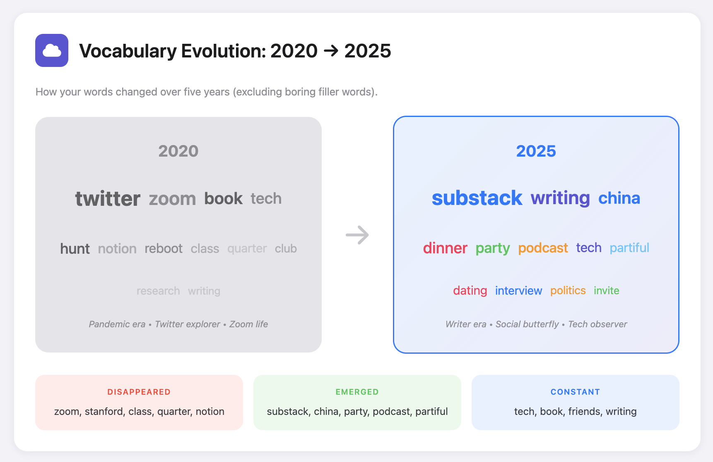
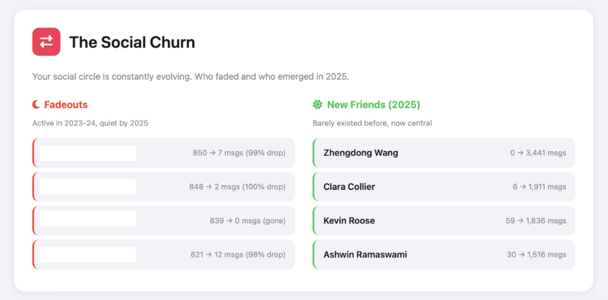

# iMessage Wrapped

Generate a beautiful, Spotify Wrapped-style analysis of your iMessage history. See your top contacts, messaging patterns, vocabulary evolution, and relationship insights—all processed locally on your Mac.

**Privacy First:** All analysis happens locally on your machine. Your messages never leave your computer.


## Features

- **Your Top People**: See who you message most, with podium-style rankings
- **Relationships Over Time**: Stacked area chart showing how your top contacts evolved
- **When You Text**: Heatmap showing your texting patterns by hour and day of week
- **Vocabulary Evolution**\*: See how your vocabulary changed over the years
- **Grammar: Who Gets Your Best English**\*: Formal vs casual contacts based on punctuation and capitalization
- **Agreement vs Debate**\*: Who you agree with most vs who you debate with
- **The Social Churn**\*: Fadeouts and rising stars in your contact list
- **Surprising Relationship Dynamics**: Automatically generated observations about your messaging patterns
- **Connection Changes**: Fading friendships and emerging connections
- **Hidden Data Insights**: Link sharing, attachments, SMS vs iMessage breakdown
- **AI-Generated Insights** (Optional): Personalized narratives using Claude Code CLI
- **Explore Your Data**: Compare any two contacts side-by-side with 12 stats

\*These sections only appear if sufficient data is available





## Requirements

- **macOS** (iMessage stores its database locally on Mac)
- **Python 3.10+**
- **uv** (recommended) or pip for package management
- **Full Disk Access** for your terminal app (required to read the iMessage database)
- **Claude Code CLI** (optional, for LLM-powered insights)

## Setup

### 1. Grant Full Disk Access

Your terminal needs permission to read `~/Library/Messages/chat.db`:

1. Open **System Preferences** → **Privacy & Security** → **Full Disk Access**
2. Click the lock to make changes
3. Add your terminal app (Terminal, iTerm2, VS Code, etc.)
4. Restart your terminal

### 2. Install Dependencies with uv (recommended)

```bash
# Clone the repository
git clone https://github.com/yourusername/imessage-wrapped.git
cd imessage-wrapped

# Install uv (if not already installed)
curl -LsSf https://astral.sh/uv/install.sh | sh

uv pip install -r requirements.txt

# Download NLTK data (for text analysis)
uv run python -c "import nltk; nltk.download('punkt'); nltk.download('stopwords'); nltk.download('vader_lexicon')"
```

<details>
<summary>Alternative: using pip</summary>

```bash
python3 -m venv venv
source venv/bin/activate
pip install -r requirements.txt
python -c "import nltk; nltk.download('punkt'); nltk.download('stopwords'); nltk.download('vader_lexicon')"
```
</details>

### 3. Configure (Optional)

Edit `config.py` to customize:

```python
# Date range to analyze
START_YEAR = 2017
END_YEAR = 2026

# Contacts to exclude (yourself, businesses, etc.)
EXCLUDED_CONTACTS = {
    "your name here",
    # Add spam/business numbers
}
```

### 4. Run

```bash
uv run python main.py
```

The script will:
1. Extract messages from your iMessage database
2. Resolve phone numbers to contact names
3. Run analysis on relationships, timing, and content
4. Generate an HTML report

Open the report:
```bash
open output/wrapped.html
```

## Usage

```bash
# Full analysis (minus LLM insights)
uv run python main.py

# Generate LLM insights (requires Claude Code CLI, uses ~250k Opus tokens)
uv run python main.py --llm

# Force regenerate LLM insights even if cached (~250k Opus tokens)
uv run python main.py --regenerate-llm
```

## LLM Insights (Optional)

The report can include AI-generated narrative insights about your communication patterns. This requires [Claude Code CLI](https://claude.ai/cli) to be installed.

To enable:
1. Install Claude Code CLI and authenticate
2. Run with `--llm` flag

The LLM generates:
- A narrative summary of your year in messaging
- A psychological profile of your communication style

Results are cached in `output/data/llm_insights.json`. Use `--regenerate-llm` to force regeneration.

## Output

- `output/wrapped.html` - The main visual report
- `output/data/llm_insights.json` - Cached LLM responses
- `output/data/` - JSON and parquet files for further analysis

## Customization

The HTML report in `output/wrapped.html` can be further customized. The current styling uses an iMessage-inspired aesthetic with iOS system colors.

## Troubleshooting

### "Permission denied" when reading chat.db
Make sure you've granted Full Disk Access to your terminal app and restarted it.

### Missing contact names
The script tries to match phone numbers to your Contacts. For unresolved contacts, you can manually edit `output/data/contacts.json`.

### Analysis is slow
Content analysis (sentiment, topics) can take a few minutes for large message histories. The progress will be displayed in the terminal.

## Privacy

- All processing happens locally on your Mac
- No data is sent to any server
- The `output/` directory contains your personal data—don't commit it to git!

## License

MIT

## Credits

Generated with Claude Code
