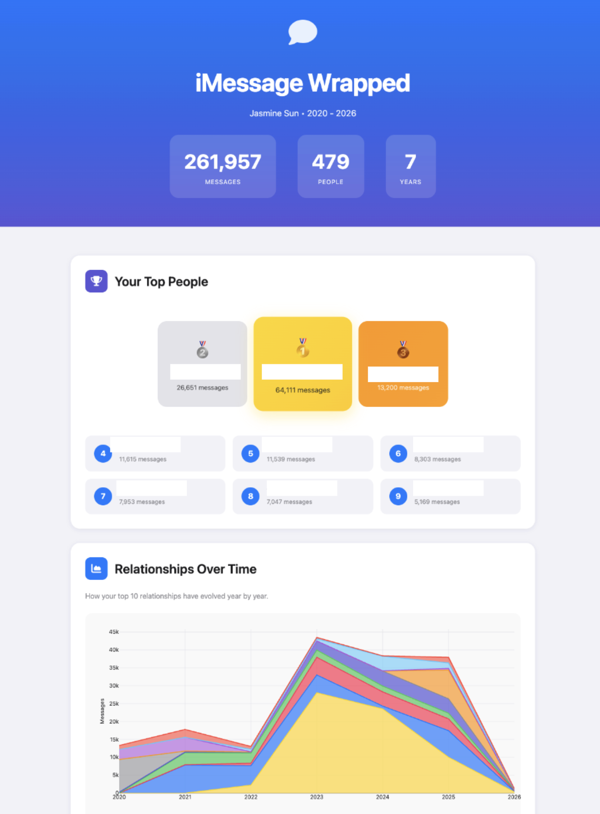

# iMessage Wrapped

Generate a beautiful, Spotify Wrapped-style analysis of your iMessage history. See your top contacts, messaging patterns, vocabulary evolution, and relationship insights—all processed locally on your Mac.

**Privacy First:** All analysis happens locally on your machine. Your messages never leave your computer.



## Features

- **Top Contacts**: See who you message most, with yearly breakdowns and podium-style rankings
- **Relationship Dynamics**: Discover patterns like comeback friendships, fading connections, and late-night confidants
- **Temporal Patterns**: Heatmaps showing when you text (hour × day of week)
- **Vocabulary Evolution**: Track how your language has changed over the years
- **Microgenres**: Categorize your contacts (Debate Partners, Hype People, 3am Philosophers, etc.)
- **Content Analysis**: Sentiment, question ratios, and conversation styles per contact

## Requirements

- **macOS** (iMessage stores its database locally on Mac)
- **Python 3.10+**
- **Full Disk Access** for your terminal app (required to read the iMessage database)

## Setup

### 1. Grant Full Disk Access

Your terminal needs permission to read `~/Library/Messages/chat.db`:

1. Open **System Preferences** → **Privacy & Security** → **Full Disk Access**
2. Click the lock to make changes
3. Add your terminal app (Terminal, iTerm2, VS Code, etc.)
4. Restart your terminal

### 2. Install Dependencies

```bash
# Clone the repository
git clone https://github.com/yourusername/imessage-wrapped.git
cd imessage-wrapped

# Create virtual environment
python3 -m venv venv
source venv/bin/activate

# Install dependencies
pip install -r requirements.txt

# Download NLTK data (for text analysis)
python -c "import nltk; nltk.download('punkt'); nltk.download('stopwords'); nltk.download('vader_lexicon')"
```

### 3. Configure (Optional)

Edit `config.py` to customize:

```python
# Date range to analyze
START_YEAR = 2017
END_YEAR = 2026

# Contacts to exclude (yourself, businesses, etc.)
EXCLUDED_CONTACTS = {
    "your name here",
    # Add spam/business numbers
}
```

### 4. Run

```bash
python main.py
```

The script will:
1. Extract messages from your iMessage database
2. Resolve phone numbers to contact names
3. Run analysis on relationships, timing, and content
4. Generate an HTML report

Open the report:
```bash
open output/wrapped.html
```

## Output

- `output/wrapped.html` - The main visual report
- `output/data/` - JSON and parquet files for further analysis

## Customization

The HTML report in `output/wrapped.html` can be further customized. The current styling uses an iMessage-inspired aesthetic with iOS system colors.

## Troubleshooting

### "Permission denied" when reading chat.db
Make sure you've granted Full Disk Access to your terminal app and restarted it.

### Missing contact names
The script tries to match phone numbers to your Contacts. For unresolved contacts, you can manually edit `output/data/contacts.json`.

### Analysis is slow
Content analysis (sentiment, topics) can take a few minutes for large message histories. The progress will be displayed in the terminal.

## Privacy

- All processing happens locally on your Mac
- No data is sent to any server
- The `output/` directory contains your personal data—don't commit it to git!

## License

MIT

## Credits

Generated with Claude Code
